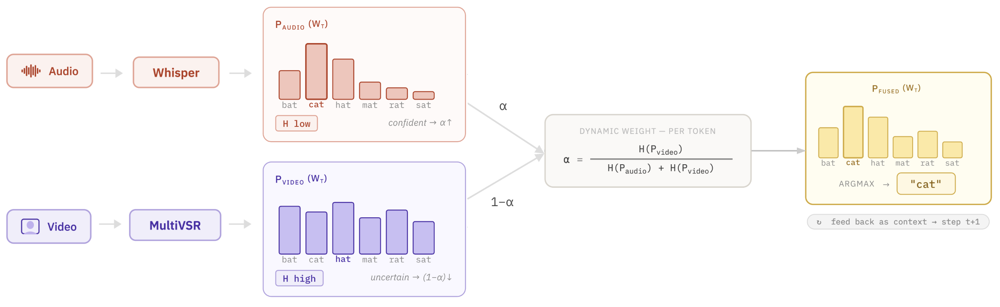

# Audio-Visual Speech Recognition (AVSR)

This folder contains the AVSR experiments reported in the paper:
**Shallow fusion between our VSR model (video) and a fine-tuned Whisper
model (audio) under noisy conditions.**

The VSR model uses the [MultiVSR](https://github.com/Sindhu-Hegde/multivsr)
architecture (Prajwal et al., 2025), trained on our VSRo-200 dataset.

The motivation: visual speech recognition is unaffected by acoustic
noise. At low SNRs, fusing video predictions with audio predictions
substantially improves over audio-only (Whisper) decoding.

## Architecture



At each decoding step, we combine the next-token log-probabilities from
Whisper (audio branch) and from our VSR encoder-decoder (video branch),
then perform standard beam search on the averaged distribution.

## Quick start

From the repository root, after running the main `bash scripts/setup.sh`:

```bash
cd evaluation/avsr
python inference_avsr.py --fpath samples_avsr/sample_1_babble_SNR-5.mp4
```

Expected output (on the first demo clip, with the default `hibrid_logp`
fusion mode):

```
[device] cuda
[load] Downloading VSR model from vsro200/models-vsro200/checkpoints/model_200h_auto.pt ...
[load] Downloading Whisper from vsro200/whisper-small-vsro200 ...
[load] ✅ All models loaded successfully
[video] Frames extracted: (1, 3, 222, 96, 96)
[audio] Samples loaded:   140288 (8.77s @ 16 kHz)
[infer] Running inference (mode=hibrid_logp) ...
──────────────────────────────────────────────────────────────────────
File:           samples_avsr/sample_1_babble_SNR-5.mp4
Mode:           hibrid_logp
Transcription:  mi-au greșit prieteni foarte apropiați cărora eu nu le-am găsit explicații de ce au făcut asta eu nu le-am greșit nu le niciodată
Reference:      mi-au greșit prieteni foarte apropiați cărora eu nu le-am găsit explicații de ce au făcut asta eu negreșindu-le niciodată
WER:            26.32%
CER:            9.09%
──────────────────────────────────────────────────────────────────────
```

For comparison, the same clip decoded with audio-only and video-only
baselines yields:

| Mode | WER | CER |
| --- | --- | --- |
| `whisper` (audio only) | 68.42% | 23.14% |
| `multivsr` (video only) | 73.68% | 25.62% |
| `hibrid_logp` (fusion) | **26.32%** | **9.09%** |

A drop of 42 absolute WER points over Whisper alone, on a clip with
−5 dB babble noise.

## Decoding modes

The `--mode` flag selects how predictions are produced:

- **`hibrid_logp`** (default): shallow fusion at the log-probability
  level at each decoding step. **This is the main reported method.**
- **`whisper`**: audio-only baseline (Whisper alone).
- **`multivsr`**: video-only baseline (our VSR model alone).

To compare all three on the same clip:

```bash
for mode in whisper multivsr hibrid_logp; do
    python inference_avsr.py --fpath samples_avsr/sample_1_babble_SNR-5.mp4 --mode $mode
done
```

## Demo samples

We provide 5 demo MP4 clips with noise pre-mixed into the audio track
at varying SNRs. The video remains a clean face crop; only the
audio is degraded. This means the same clip can be decoded with all
three modes to directly observe the effect of fusion.

| File | Noise | SNR | Reference (truncated) |
| --- | --- | --- | --- |
| `sample_1_babble_SNR-5.mp4` | babble (4-speaker) | −5 dB | "mi-au greșit prieteni foarte apropiați..." |
| `sample_2_gaussian_SNR0.mp4` | gaussian (white) | 0 dB | "moment chimie însemnând să te uiți la omul ăla..." |
| `sample_3_gaussian_SNR5.mp4` | gaussian (white) | 5 dB | "să nu eu nu țin ură nu țin pică..." |
| `sample_4_babble_SNR10.mp4` | babble (4-speaker) | 10 dB | "iar oamenii de la care nu știu n-aveam așteptări..." |
| `sample_5_babble_SNR15.mp4` | babble (4-speaker) | 15 dB | "mi-era tare drag de ei așa" |

Babble noise is sampled from [MUSAN](https://www.openslr.org/17/),
mixed from 4 randomly selected speakers. Full reference transcriptions
are in [`samples_avsr/samples_avsr_metadata.csv`](samples_avsr/samples_avsr_metadata.csv).


<!-- 
## Reported results

WER (lower is better) on the `test_valid` split (100 clips), averaged
across two noise types (babble and gaussian) at each SNR level:

| SNR (dB) | Whisper ZS | Whisper FT | VSR | Fusion (logp, ZS) | **Fusion (logp, FT)** |
| --- | --- | --- | --- | --- | --- |
| **−5** | 0.922 | 1.125 | 0.505 | 0.792 | **0.433** |
| **0**  | 0.704 | 0.463 | 0.505 | 0.511 | **0.279** |
| **5**  | 0.474 | 0.231 | 0.505 | 0.347 | **0.191** |
| **10** | 0.308 | 0.158 | 0.505 | 0.224 | **0.154** |
| **15** | 0.232 | 0.128 | 0.505 | 0.188 | **0.126** |

ZS = zero-shot Whisper (`alexandradiaconu/whisper-small-echo-34`).
FT = fine-tuned on VSRo + noise (our `vsro200/whisper-small-vsro200`,
adapted from [Diaconu et al., 2026](https://arxiv.org/abs/2603.02368)).

 -->


## CLI options

```
--fpath          Path to input video (.mp4 or .avi, 160x160 with audio track)
--vsr_model      HF repo for the VSR model (default: vsro200/models-vsro200/checkpoints/model_200h_auto.pt)
--whisper_model  HF repo for Whisper (default: vsro200/whisper-small-vsro200)
--mode           hibrid_logp | whisper | multivsr (default: hibrid_logp)
--beam_size      Beam size (default: 5)
--max_len        Max output tokens (default: 256)
--metadata       Metadata CSV for WER lookup (default: samples_avsr/samples_avsr_metadata.csv)
--device         cuda | cpu (default: auto-detect)
```

<!-- ## Running on your own clips

To test on your own noisy clips:

1. Make sure your video is a 160×160 face crop (use the MultiVSR
   preprocessing pipeline — see [`../../docs/PREPROCESSING.md`](../../docs/PREPROCESSING.md)).
2. Mix audio with noise at the desired SNR (e.g., with `ffmpeg` and
   MUSAN babble samples).
3. Mux the noisy audio back into the video as a single MP4:
   ```bash
   ffmpeg -i your_video.mp4 -i your_noisy_audio.wav \
          -c:v copy -map 0:v:0 -map 1:a:0 -shortest \
          your_clip_with_noise.mp4
   ```
4. Run inference:
   ```bash
   python inference_avsr.py --fpath your_clip_with_noise.mp4
   ``` -->

## Citation

If you use the AVSR setup, please cite our paper as well as the underlying
audio model and Whisper itself:

```bibtex
@misc{diaconu2026ron3ws,
  title  = {RO-N3WS: Enhancing Generalization in Low-Resource ASR with
            Diverse Romanian Speech Benchmarks},
  author = {Diaconu, Alexandra and Vînagă, Mădălina and Alexe, Bogdan},
  year   = {2026},
  url    = {https://arxiv.org/abs/2603.02368},
}

@misc{radford2022whisper,
  title  = {Robust Speech Recognition via Large-Scale Weak Supervision},
  author = {Radford, Alec and Kim, Jong Wook and Xu, Tao and Brockman, Greg
            and McLeavey, Christine and Sutskever, Ilya},
  year   = {2022},
  url    = {https://arxiv.org/abs/2212.04356},
}
```
